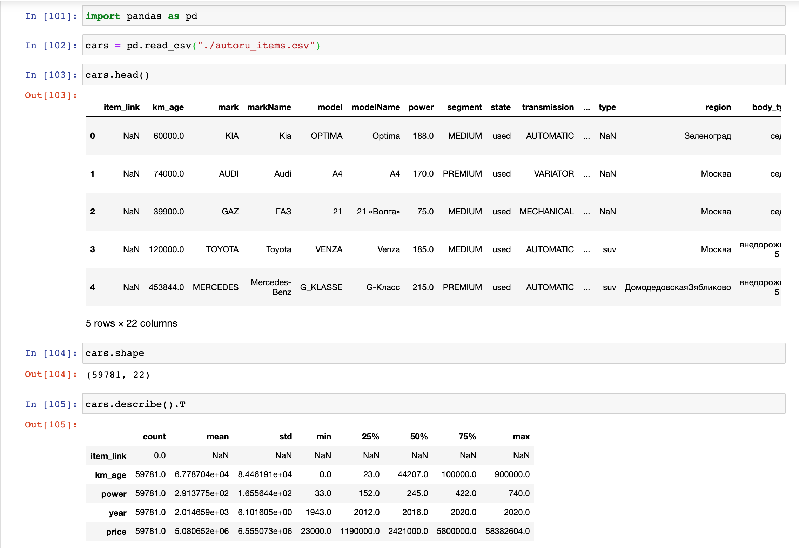
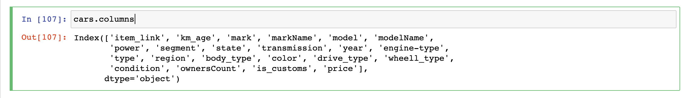
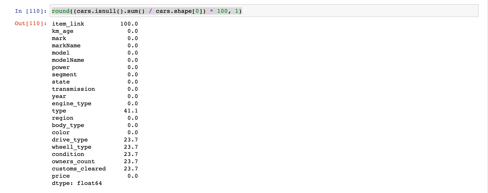
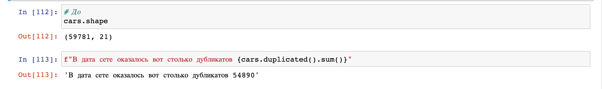
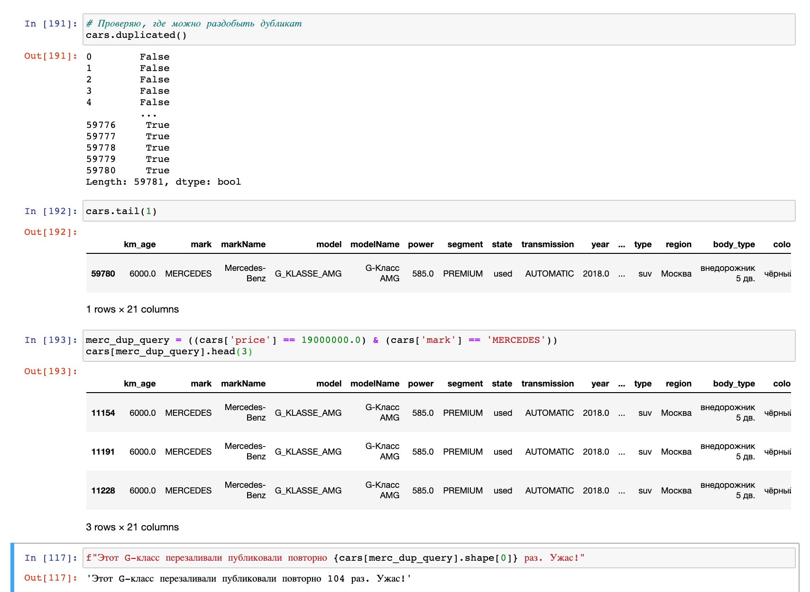
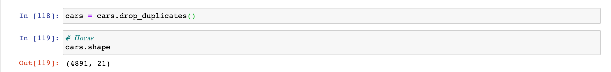
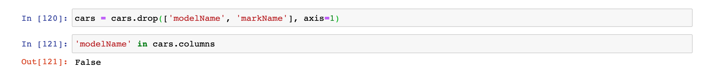
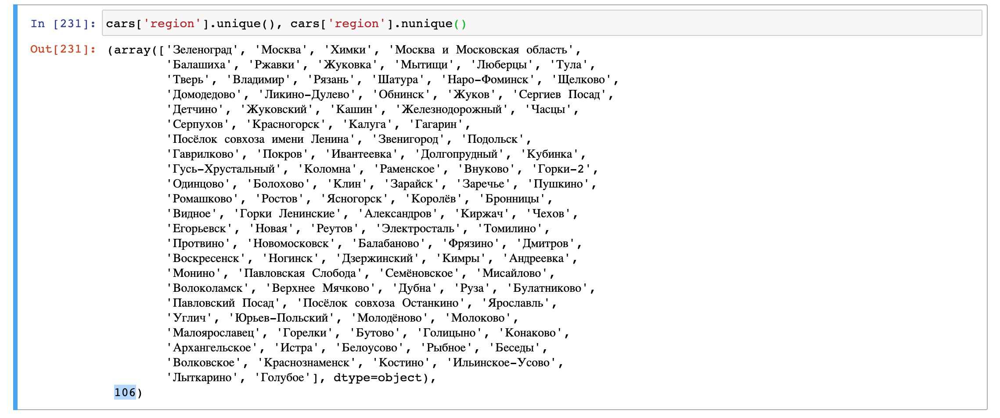

# Анализ объявление на сайте Auto.ru

## Знакомство с проектом

## Описание данных:
| Параметр | Тип | Описание    |
| :-- | :-- | :-- |
| `km_age`           | `int`    | пробег |
| `mark`     | `str`    | марка |
| `markName`     | `str`    | марка, тоже самое что `mark` |
| `model`         | `str`    | модель |
| `modelName`         | `str`    | модель, тоже самое что `modelName`  |
| `power`       | `int`   | количество лошадиных сил |
| `segment`         | `str`  | сегмент (`ECONOMY/MEDIUM/PREMIUM`) |
| `state`           | `str`  | состояние автомобиля |
| `transmission`   | `str`    | коробка передач |
| `year`     | `int`    | год выпуска |
| `engine-type`     | `str`    | тип двигателя |
| `type`         | `str`   | тип автомобиля (`suv`) |
| `region`  | `str`    | город продажи |
| `body_type`  | `str`    | тип кузова |
| `color`  | `str`    | цвет |
| `drive_type`  | `str`    | привод |
| `wheell_type`  | `str`    | тип руля (право-/леворульный) |
| `condition`  | `str`    | состояние автомобиля |
| `ownersCount`  | `str`    | количество владельцев |
| `is_customs`  | `str`    | растоможенность |
| `price`  | `int`    | цена автомобиля |


## Очистка и обработка данных

Полный код можно найти в [`jupyter notebook`](https://nbviewer.jupyter.org/github/ArthurBodrov/autoru_analytics/blob/main/Cleaning.ipynb).

Первично просматриваем данные.



Просматривая колонки замечаем, что они написанные в разном формате, например, `engine-type, ownersCount и km_age` написанным 3 разными стилями через тире, camel case и snike case. Исправим это, приведем к snike case.



### Переименование колонок
1. engine-type -> engine_type, чтобы соотвестовала единному стилю
2. is_customs -> customs_cleared, чтобы улучшить понимание, что это за фича
3. ownersCount -> owners_count
   
```python
cars = cars.rename(columns={'engine-type': 'engine_type', 'is_customs': 'customs_cleared', "ownersCount": "owners_count"})

# Проверяем изменение 
cars.columns

# Выводит
Index(['item_link', 'km_age', 'mark', 'markName', 'model', 'modelName',
       'power', 'segment', 'state', 'transmission', 'year', 'engine_type',
       'type', 'region', 'body_type', 'color', 'drive_type', 'wheell_type',
       'condition', 'owners_count', 'customs_cleared', 'price'],
      dtype='object')
```

### Вывожу процент заполненных данных



```python
cars = cars.drop('item_link', axis=1) # Дропаю 100% пропущенную фичу 
```

### А есть ли дубликаты в моем дата сете? Сейчас проверим.



**54 тысячи дубликатов!** Я не поверил, поэтому решил проверить сам.

Ищу дубликат и проверяю его.




54 тысячи дубликатов стали похожи на правду.

Дропаю дубликат и в дата сете остается **4 891 наблюдений**.



Займемся чисткой данных.

## Чистка данных
1. Дропнуть modelName и markName
2. Превести body_type и color  к одному формату.
3. Заменить станции метро на город в region.
4. Скорее всего `nan - drive_type, wheell_type, condition, ownersCount, customs_cleared` потому что это новые автомобили. А скрепер не может взять эти данные, поскольку они не доступны.
5. Нужно ли дропнуть type?

#### 1. Дропнуть modelName и markName
**Проблема:** Колонки дублируются. model и modelName, mark и markName предоставляют одно и ту же информацию.



#### 2. Превести body_type и color к одному формату. Сейчас плохо ('внедорожник 5 дв.', 'Внедорожник 5 дв.')
**Проблема:** 'внедорожник 5 дв.', 'Внедорожник 5 дв.' - это 2 разных варианта.

|Было|Стало|
|---|---|
|**30 вариантов** - `['седан', 'внедорожник 5 дв.', 'Внедорожник 5 дв.', 'Седан', ... ]` | **20 вариантов**  - `['седан', 'внедорожник 5 дв.', 'универсал 5 дв.', ... ]` |
| **27 вариантов** - `['Зелёный', 'синий', 'Синий', 'зелёный' .. ]` | **15 вариантов**  - `['синий', 'белый', 'серый', 'чёрный', 'оранжевый', 'коричневый', ... ]`|

#### 3. Заменить станции метро на город в `region`
**Проблема:** на сайте не всегда указывают город, в большинстве указывают станцию метро. Разобразие названий метро будет мешать обучится модели, поэтому надо превести их в единому типу.
Для этого я собрал название метро и МЦД в файл `moscow_stations.csv`
Также я выделил некоторые станции МЦД в зону ***Москва и Московская область***.

Всего уникальных названий ***329***, это точно собьет модель с толку.

Мапим значения метро к значению `"Москва"` и получаем ***106*** уникальных названий. Отлично!




