# Анализ объявление на сайте Auto.ru

## Зачем я сделал этот проект?

> **Я хотел изучить, какие характеристики автомобиля ключевые при формировании цены.** Как пробег изменяет цену машины? Автомобили с каким цветов стоят больше всего? Как коррелирует между собой цена машины и кол-во лошадиных сил? Праворульный автомобиль стоит меньше, чем аналогичный леворульный?

# Сбор данных

Я собрал реальные объявления о продаже автомобилей с сайта Auto.ru. Для этого мне понабодился скрепер и я его написал сам https://github.com/ArthurBodrov/autoru_scraper 

Скрепер собирает данные в таком виде ⬇️.

## Описание данных:
| Параметр | Тип | Описание    |
| :-- | :-- | :-- |
| `km_age`           | `int`    | пробег |
| `mark`     | `str`    | марка |
| `markName`     | `str`    | марка, тоже самое что `mark` |
| `model`         | `str`    | модель |
| `modelName`         | `str`    | модель, тоже самое что `model`  |
| `power`       | `int`   | количество лошадиных сил |
| `segment`         | `str`  | сегмент (`ECONOMY/MEDIUM/PREMIUM`) |
| `state`           | `str`  | состояние автомобиля (новый или б/у) |
| `transmission`   | `str`    | коробка передач |
| `year`     | `int`    | год выпуска |
| `engine-type`     | `str`    | тип двигателя |
| `type`         | `str`   | тип автомобиля (`suv`) |
| `region`  | `str`    | город продажи |
| `body_type`  | `str`    | тип кузова |
| `color`  | `str`    | цвет |
| `drive_type`  | `str`    | привод |
| `wheell_type`  | `str`    | тип руля (право-/леворульный) |
| `condition`  | `str`    | состояние автомобиля, необходим ли ремонт|
| `ownersCount`  | `str`    | количество владельцев |
| `is_customs`  | `str`    | растаможенность |
| `price`  | `int`    | цена автомобиля |


# Очистка и обработка данных

<details>
<summary>Очистка и обработка данных</summary>

## Очистка и обработка данных

Полный код можно найти в [`jupyter notebook`](https://nbviewer.jupyter.org/github/ArthurBodrov/autoru_analytics/blob/main/Notebooks/Cleaning.ipynb).

Первично просматриваем данные.


Просматривая колонки замечаем, что они написанные в разном формате, например, `engine-type, ownersCount и km_age` написанным 3 разными стилями через тире, camel case и snike case. Исправим это, приведем к единому стилю - snike case.


### Переименование колонок
1. engine-type -> engine_type, чтобы соотвестовала единому стилю
2. is_customs -> customs_cleared, чтобы улучшить понимание, что это за фича
3. ownersCount -> owners_count
   
```python
cars = cars.rename(columns={
    'engine-type': 'engine_type', 
    'is_customs': 'customs_cleared', 
    'ownersCount': 'owners_count'})

# Проверяем изменение 
cars.columns

# Выводит
Index(['item_link', 'km_age', 'mark', 'markName', 'model', 'modelName',
       'power', 'segment', 'state', 'transmission', 'year', 'engine_type',
       'type', 'region', 'body_type', 'color', 'drive_type', 'wheell_type',
       'condition', 'owners_count', 'customs_cleared', 'price'],
      dtype='object')

```


### А есть ли дубликаты в моем дата сете? Сейчас проверим.


**54 тысячи дубликатов!** Я не поверил, поэтому решил проверить сам.

Ищу наблюдение-дубликат и проверяю, что он действительно дубликат руками.


Ну если только это наблюдение залили 104 раз, то 54 тысячи дубликатов становится похожами на правду.

Дропаю дубликат и в дата сете остается **4 891 наблюдений**.


Займемся чисткой данных.

### Вывожу процент незаполненных данных


```python
cars = cars.drop('item_link', axis=1) # Дропаю 100% пропущенную фичу 
```

## Чистка данных
1. Нужно дропнуть modelName и markName.
2. Превести body_type и color  к одному формату.
3. Заменить станции метро на город в region.
4. Скорее всего `nan - drive_type, wheell_type, condition, ownersCount, customs_cleared` потому что это новые автомобили. А скрепер не может взять эти данные, поскольку они не доступны.
5. Нужно ли дропнуть type?

#### 1. Дропнуть modelName и markName
**Проблема:** Колонки дублируются. model и modelName, mark и markName предоставляют одно и ту же информацию. (model = "ВАЗ", modelName = "VAZ")


#### 2. Превести body_type и color к одному формату. Сейчас неправильно ('внедорожник 5 дв.', 'Внедорожник 5 дв.')
**Проблема:** 'внедорожник 5 дв.', 'Внедорожник 5 дв.' - это 2 разных варианта.

|Было|Стало|
|---|---|
|**30 уникальных вариантов** - `['седан', 'внедорожник 5 дв.', 'Внедорожник 5 дв.', 'Седан', ... ]` | **20 уникальных вариантов**  - `['седан', 'внедорожник 5 дв.', 'универсал 5 дв.', ... ]` |
| **27 уникальных вариантов** - `['Зелёный', 'синий', 'Синий', 'зелёный' .. ]` | **15 уникальных вариантов**  - `['синий', 'белый', 'серый', 'чёрный', 'оранжевый', 'коричневый', ... ]`|

#### 3. Заменить станции метро на город в колонке `region`.
**Проблема:** на сайте не всегда указывают город, в большинстве указывают станцию метро. Разобразие названий метро будет мешать обучится модели, поэтому надо превести их в единому типу. Единый тип - город, где размещается объявление. Для этого я собрал название метро и МЦД в файл `moscow_stations.csv`
Также я выделил некоторые станции МЦД в зону ***Москва и Московская область***.

Всего уникальных названий ***329***, это точно собьет модель с толку.

Мапим значения метро к значению `"Москва"` и получаем ***106*** уникальных названий. Отлично!


#### 4. Скорее всего фичи nan - drive_type, wheell_type, condition, ownersCount, customs_cleared потому что это новые автомобили
**Проблема:** Для новых автомобилей нет информации о приводе, тип лево-/праворульная, кол-во владельцев и растоможена ли она или нет.

Для начала проверить гипотезу - "... nan - drive_type, wheell_type, condition, ownersCount, customs_cleared потому что это новые автомобили"

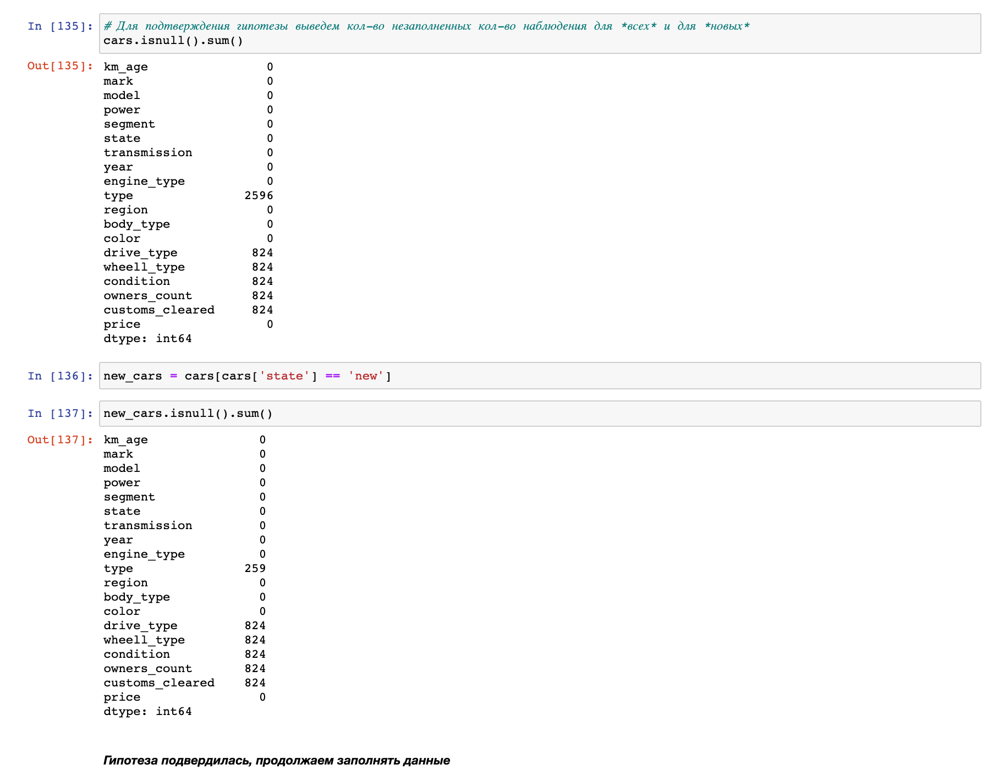 

**Гипотеза подтвердилась!**

Поскольку привод неизвестен, заполним значения новой категорией 'неизвестно'.

```python
cars['drive_type'].unique()

# Выводит 
array(['передний', 'задний', 'полный', nan], dtype=object)
```

```python
cars['drive_type'] = cars['drive_type'].fillna('неизвестно')
cars['drive_type'].isnull().sum()

# Выводит
0
```

Добавим колонку `drive_type_imputed` для исскуственно проставленных значений. Это может помочь моделям лучше обучится. 

Для этого найдет индекс колонки `drive_type`, и добавим новую колонку `drive_type_imputed` рядом с ней. Я делаю это для удобства.

```python
enum_col = [(i, col) for i, col in enumerate(cars.columns)]
enum_col

# Выводит
[(0, 'km_age'),
 (1, 'mark'),
 (2, 'model'),
 (3, 'power'),
 (4, 'segment'),
 (5, 'state'),
 (6, 'transmission'),
 (7, 'year'),
 (8, 'engine_type'),
 (9, 'type'),
 (10, 'region'),
 (11, 'body_type'),
 (12, 'color'),
 (13, 'drive_type'),
 (14, 'wheell_type'),
 (15, 'condition'),
 (16, 'owners_count'),
 (17, 'customs_cleared'),
 (18, 'price')]
```

```python
cars.insert(14, 'drive_type_imputed', 0)
```

```python
'drive_type_imputed' in cars.columns

# Выводит
True
```

Заполняем колонку `drive_type_imputed` значением `1` наблюдения с категорией 'неизвестно'. Поскольку первоначально все значения были заполненный нулями.

```python
mask = cars['drive_type'] == 'неизвестно'
cars.loc[mask, 'drive_type_imputed'] = 1
```

Отлично, переходим к `whell_type`.

Большинство новых автомобилей леворульные, поэтому заполняем их как леворульные.

```python
cars['wheell_type'].unique() 

# Выводит
array(['Левый', nan, 'Правый'], dtype=object)
```

```python
cars['wheell_type'] = cars['wheell_type'].fillna('Левый')

cars['wheell_type'].isnull().sum()

# Выводит
0
```

Теперь заполним `whell_type`.

Состояние машин заполняем, как "новая". Поскольку автомобили новые :).

```python
cars['condition'].unique()

# Выводит
array(['Не требует ремонта', nan], dtype=object)
```

```python
cars['condition'] = cars['condition'].fillna('Новая')

cars['condition'].isnull().sum()

# Выводит
0
```

Заполним `owners_count`.

У новых автомобилей не было владельцев, заполняем - "0 владельцев"

```python
cars['owners_count'].unique()

# Выводит
array(['1 владелец', '3 или более', '2 владельца', nan],
      dtype=object)
```

```python
cars['owners_count'] = cars['owners_count'].fillna('0 владельцев')

cars['owners_count'].isnull().sum()

# Выводит
0
```

Все новые автомобили растаможены, заполняем "Растаможен" колонку `customs_cleared`.

```python
cars['customs_cleared'].unique()

# Выводит
array(['Растаможен', nan], dtype=object)
```

```python
cars['customs_cleared'] = cars['customs_cleared'].fillna('Растаможен')

cars['customs_cleared'].isnull().sum()

# Выводит
0
```

#### 5. Нужно ли дропнуть type?
**Проблема:** type - тип автомобиля, который заполнен только одним значением `suv`. Дропнуть его или нет?

Вычислим процент пропущенных значений.

```python
n_null_type = cars['type'].isnull().sum()

f'В процентах это будет {round((n_null_type / cars.shape[0]) * 100, 2)}%'

# Выводит
'В процентах это будет 53.08%'
```

```python
cars['type'].unique()

# Выводит
array([nan, 'suv'], dtype=object)
```

53% это много + есть всего 1 одно значение `suv`. Решаю **дропнуть** значение.

```python
cars = cars.drop('type', axis=1)

'type' in cars.columns

# Выводит
False
```

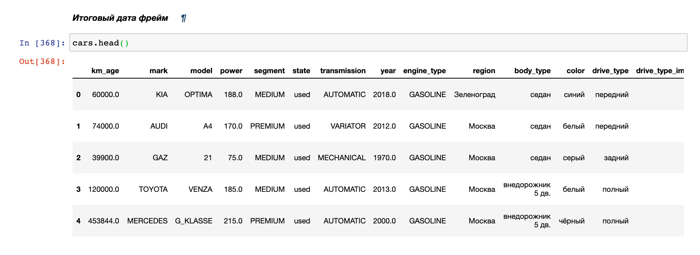

### И последний штрих 
`km_age`, `power`, `price`, `year` - это целочисленные значения, но тут распознаются как float (см на картинку сверх, там можно в этом убедится). Исправим это.

### `Km_age`

```python
print(f"Было: {cars['km_age'].dtype}")
cars['km_age'] = cars['km_age'].astype("int32")
print(f"Стало: {cars['km_age'].dtype}")

# Выводит
Было: float64
Стало: int32
```

### `Power`

```python
print(f"Было: {cars['power'].dtype}")
cars['power'] = cars['power'].astype("int32")
print(f"Стало: {cars['power'].dtype}")

# Выводит
Было: float64
Стало: int32
```

### `Year`

```python

print(f"Было: {cars['year'].dtype}")
cars['price'] = cars['year'].astype("int32")
print(f"Стало: {cars['year'].dtype}")

# Выводит
Было: float64
Стало: int32
```

### `Price`

```python

print(f"Было: {cars['price'].dtype}")
cars['price'] = cars['price'].astype("int32")
print(f"Стало: {cars['price'].dtype}")

# Выводит
Было: float64
Стало: int32
```

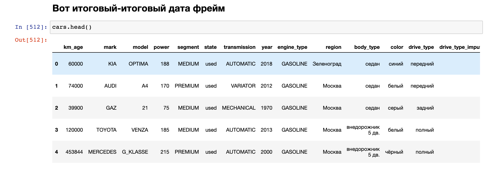

```python
cars.to_csv('autoru_cleaned.csv', index=False)
```
</details>

# Визуализация данных

Полный код можно посмотреть в [`jupyter notebook`](https://nbviewer.jupyter.org/github/ArthurBodrov/autoru_analytics/blob/main/Notebooks/Data%20Exploration.ipynb)

### Проверим есть ли выбросы в данных

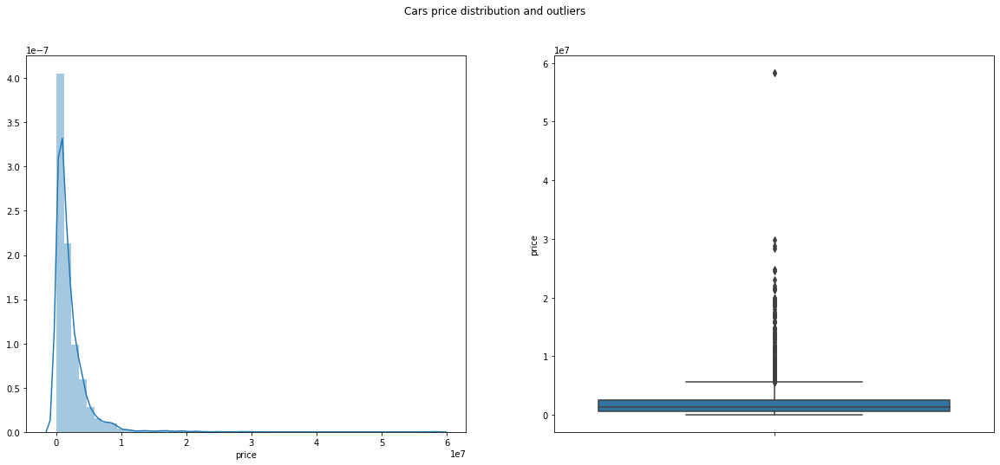

По графикам видно, что в данных есть много выбросов. Найдем их с помощью z-score и удалим.

Разница между распределение до и после.

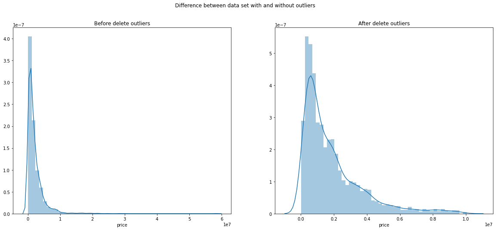

Перейдем к исследованию данных.


### У меня есть несколько гипотез, которые я бы хотел проверить.
1. Новые автомобили стоят больше, чем подержанные.
2. Чем больше лошадиных сил, тем больше цена.
3. Премиум сегмент, дороже остальных.
4. Чем больше владельцев, тем дешевле цена.
5. Чем старше автомобиль, тем он дешевле.
6. Чем больше пробег, тем дешевле автомобиль.


### 1. Новые автомобили стоят больше, чем подержанные.

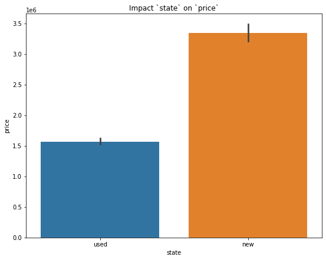

**Вывод:** Новые автомобили, действительно, стоят больше подержанных.

### 2. Чем больше лошадиных сил, тем больше цена.

Коэффициент корреляци между `power` и `price` равен ***0.63***.

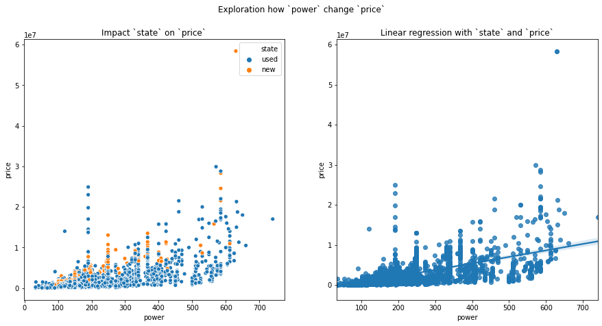

**Вывод:** Гипотеза подтвердилась. Причем не важно, будет ли это новый или б/у автомобиль.

### 3. Премиум сегмент, дороже остальных.

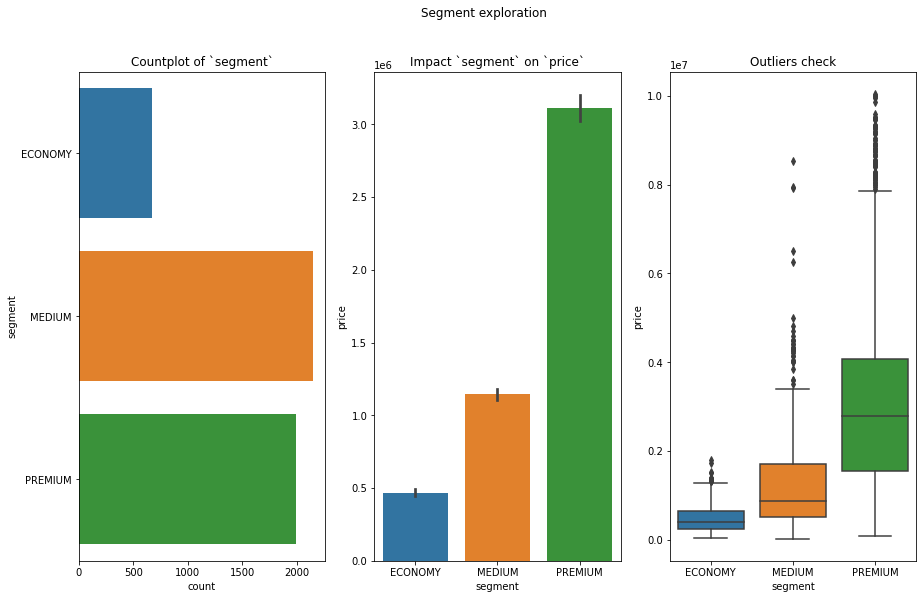

**Вывод:** *Премиум сегмент, дороже остальных* - правда. И также у категорий `MEDIUM` и `PREMIUM` очень много выбросов.

### 4. Чем больше владельцев, тем дешевле цена.

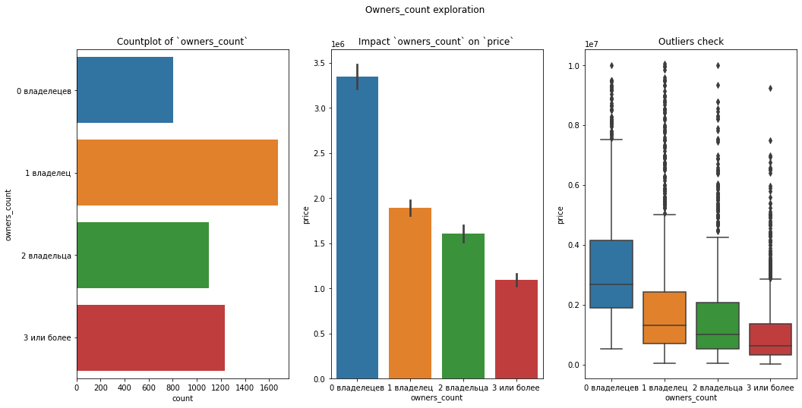

**Вывод:** Гипотеза верна. Тут как и сегментами у категорий много выбросов.

### 5. Чем старше автомобиль, тем он дешевле.

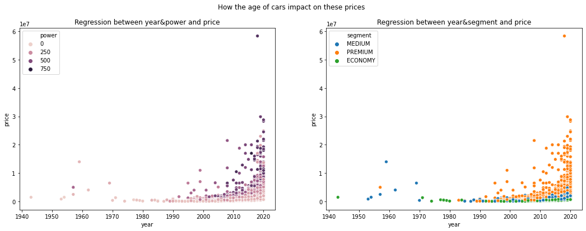

Коэффициент корреляции между `year` и `price` равен **0.49**.


**Вывод:** Гипотеза верна.

### 6. Чем больше пробег, тем дешевле автомобиль.

Коэффициент корреляции между `km_age` и `price` равен **-0.5**.

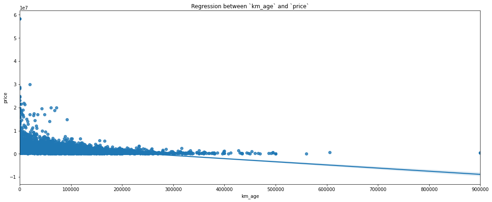

**Вывод:** Гипотеза подтвердилась.

####  Итог проверки гипотез:
1. Новые автомобили стоят больше, чем подержанные. ***Подтвердилась***
2. Чем больше лошадиных сил, тем больше цена. ***Подтвердилась***
3. Премиум сегмент, дороже остальных. ***Подтвердилась***
4. Чем больше владельцев, тем дешевле цена. ***Подтвердилась***
5. Чем старше автомобиль, тем он дешевле. ***Подтвердилась***
6. Чем больше пробег, тем дешевле автомобиль. ***Подтвердилась***

## Посмотрим на другие фичи, попробуем отрыть инсайты.

### Взгляним на `drive_type`

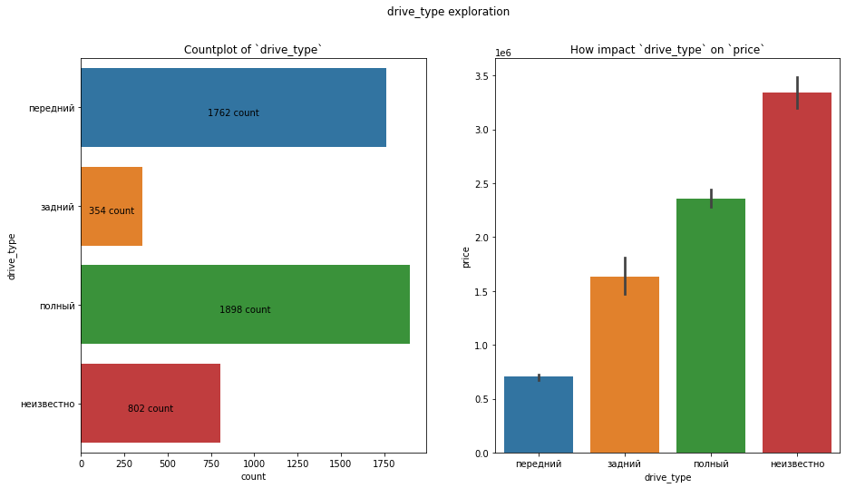

`drive_type` принесет мало пользы, поскольку самая большая цена у категории "неизвестно". А "неизвестно" означает, что автомобиль новый. И из-за того, что он новый у него большая цена.

### Исследуем `engine_type`

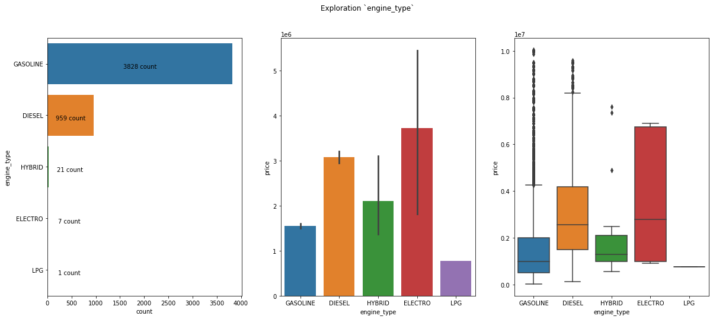

У типов: "Гибрид", "Электро", "LPG" - мало наблюдений. Это плохо потому что модель не сможет хорошо натренироваться для этих типов.

#### Проверим еще одну гитопезу - "У автомобилей в `ECONOMY` сегменте меньше лошадиных сил".

Я добавил красную линию, которая обозначает наименьшее количество лошадиных сил в `ECONOMY` сегменте. 


Выведет средние для всех категорий.

```python
for segment in cars['segment'].unique():
    print(f'Segment: {segment}, mean value: {round(cars[cars["segment"] == segment]["power"].mean(), 2)}')

# Выводит
Segment: MEDIUM, mean value: 152.24
Segment: PREMIUM, mean value: 264.98
Segment: ECONOMY, mean value: 99.44
```

"У автомобилей в `ECONOMY` сегменте меньше лошадиных сил". - **Ложь**
#### НО
"У автомобилей в `ECONOMY` сегменте ***в среднем*** меньше лошадиных сил". - **Правда**

#### У большинства автомобилей в `ECONOMY` сегменте дизельный двигатель.

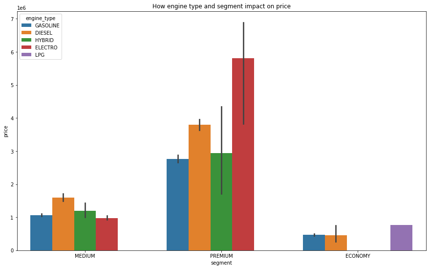

**Гипотеза не подтвердилась.**

### Автомобиль какого цвета стоит дороже всего?

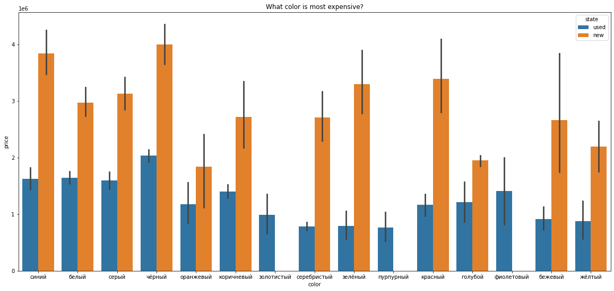

```python
color_n_price = []
for color in cars['color'].unique():
    mean_price = round(cars[cars["color"] == color]["price"].mean(), 2)
    color_n_price.append({"color": color, "mean_price": mean_price})

print(pd.DataFrame(color_n_price).nlargest(5, 'mean_price'))

# Выводит
        color  mean_price
3      чёрный  2313334.05
0       синий  2140263.23
2       серый  1946682.99
1       белый  1903897.62
5  коричневый  1593404.50
```

Дороже всего стоит автомобили черного цвета. Но надо держать в уме количество количество автомобилей и размах цен у определенного цвета. Поскольку это сильно влияет на цену автомобиля.

### Напоследок визуализирую корреляцию между фичами

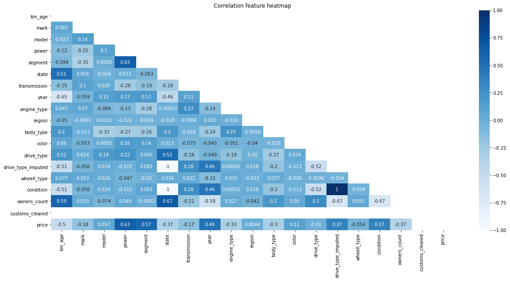

Фича customs_cleared оказалась бесполезной, поскольку все автомобили на Auto.ru растаможены. Дропнем ее.

```python
cars_encoded = cars_encoded.drop('customs_cleared', axis=1)
```

### Выводит новый дата сет без выбросов

```python
cars_encoded.to_csv('cars_encoded_no_outliers.csv', index=False)
```

# Выбор модели

В этой секцией я бы хотел ответить на вопрос, что влияет на цену автомобиля в бОльшей мере.

### Натренируем несколько моделей и проверим их перфоманс
1. Linear regression
2. Lasso regression
3. Ridge regression
4. Desicion Tree regression
5. Random Forest regression
6. Gradient Boosting regression

Пропускаем неинтересную часть с fit_predict_score. Если нужны подробности, можно посмотреть в [ноутбуке](https://nbviewer.jupyter.org/github/ArthurBodrov/autoru_analytics/blob/main/Notebooks/Model%20selection.ipynb).

Перфоманс моделей я визуализоровал с помощью `barplot`.

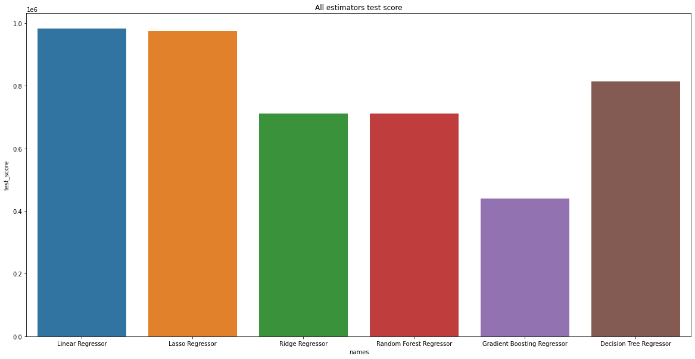

И у нас первые появлились лидеры, но еще улучшить перфоманс можно, застекав модели.

Проверим какой перфоманс у `StackingRegressor` с лучшими моделями: Ridge, RandomForest, GradientBoosting.

Перфоманс не улучшился, а даже **ухудшился**.

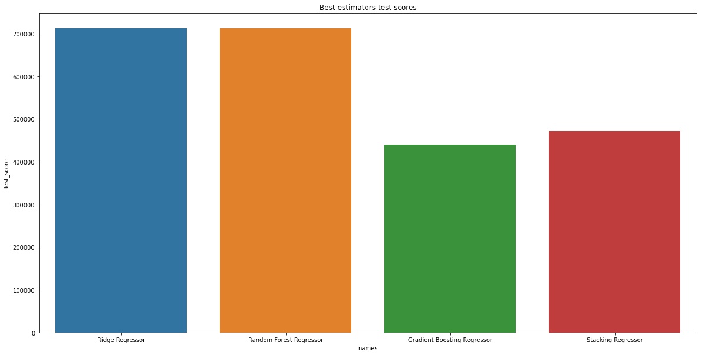

Время узнать, какие фичи формируют цену в бОльшей степени. Для этой задачи возьмем 2 лучшие модели*: Random Forest, Gradient Boosting. 

\* - лучшие и с возможностью вывести `feature_importance_`

### Feature Importance

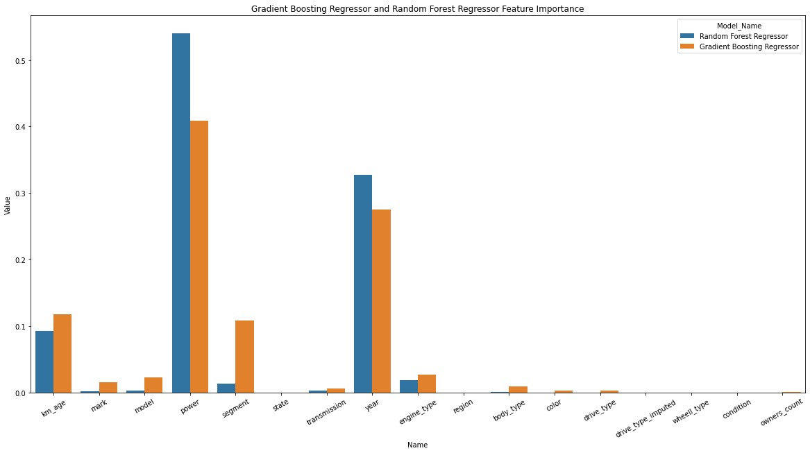

### Наиболее важными фича для моделей были:
1. Кол-во лошадиных сил
2. Год выпуска
3. Пробег
4. Сегмент
5. Тип двигателя

### *Неважными* фичи для моделей
Удивительно, но моделям не важно:
- Будет ли автомобиль новым или б/у `state`, также и необходим ли ремонт автомобилю `condition`.
- Где продается автомобиль `region`.
- Праворульный или леворульный автомобиль `whell_type`. *Примечание:* Это может быть связано с несбалансированными данными, леворульных намного больше и при обучении модель не придает этой фиче большого значения.
- Количество владельцев `owners_count`. *Примечание:* Для меня это странно. В моем сознание, чем больше владецев, тем больше автомобиль ведро с болтами. Видимо, это не является столь опредляющим фактором, ведь G-klasse AMG 2011 года с 5 владельцами и с 250 л.с. может стоить больше, чем новая семейная KIA.

 ## Как улучшить результаты?

К сожалению, перфоманс моделей получился слабым. Меня не устраивает такой исход, поэтому я приготовил идеи, как его улучшить.

Почти 5 тысяч объявлений - это маленькое количество данных для хорошего перфоманса моделей. Если я продолжал этот проект, я бы продолжил скрепить данные до тех пор, пока не набрал бы 15 тысяч уникальных объявлений.

А что нам принесут 15 тысяч объявлений? Какая от них польза? Это поможет сменить алгоритм машинного на XGBoost, LightGBM. XGBoost, LightGBM - алгоритмы с хорошем перфомансом. Но этим им нужны большие данные. Эта потребность возникает, поскольку они легко переобучаются на маленьком количество данных.

Кроме количество наблюдений, я бы увеличил кол-во фичей. Цена на G-klass,  G-klass **AMG** и G-klass **Brabus** одного и того же года сильно разнится, поскольку это разные комплектации одной и той же модели. Собрав эту информацию, перфоманс должен улучшиться, особенно, это касается новых автомобилей.

Интуитивно понимаю, что автомобиль, побывавший в ДТП, будет стоит меньше, и эта информацию может пригодится. Возможно, кто-то предоставляет сервис по проверке автомобиля на кол-во ДТП и повреждения от ДТП. И также надо проверять состояние автомобиля, - двигатель, коробку передач и тд - не требуется ли ремонт, в каком они состоянии.

# Заключение

В заключение, я хочу ответить на вопросы, которые задавал в начале.

### Как пробег изменяет цену машины?

Пробег значительно влияет на цену автомобиля. Важнее только кол-во л.с. и год выпуска.

### Автомобили с каким цветов стоят больше всего? 

Автомобили черного цвета стоит больше всего, но это вообще не является опредляющим фактором цены.

### Как коррелирует между собой цена машины и кол-во лошадиных сил? 

Количество лошадиных сил самый важный критерий для определения цены. Л. с. и цена коррелирует положительно.


### Праворульный автомобиль стоит меньше, чем аналогичный леворульный?

Для моделей машинного обучения это не является важным. Возможно, это из-за несбалансированных данных, леворульный автомобилей значительно больше праворульных. А быть может это, действительно, не играет роли. Такие кейсы надо рассматривать под микроскопом.

### Какие характеристики ключевые при формировании цены?


Наиболее важными фича для моделей были:
1. Кол-во лошадиных сил
2. Год выпуска
3. Пробег
4. Ценовой сегмент
5. Тип двигателя
6. Марка и модель автомобиля
