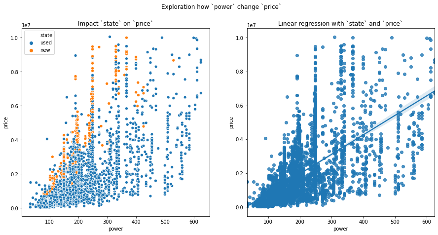
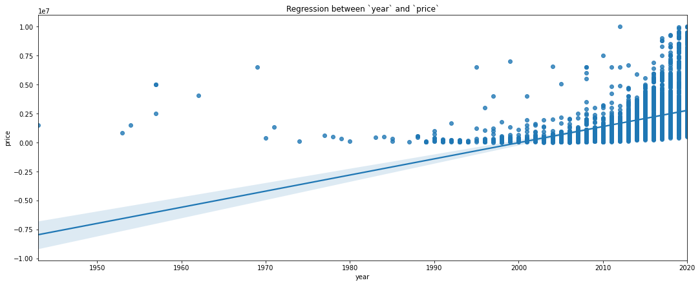

# Анализ объявление на сайте Auto.ru

## Знакомство с проектом

# Сбор данных

## Описание данных:
| Параметр | Тип | Описание    |
| :-- | :-- | :-- |
| `km_age`           | `int`    | пробег |
| `mark`     | `str`    | марка |
| `markName`     | `str`    | марка, тоже самое что `mark` |
| `model`         | `str`    | модель |
| `modelName`         | `str`    | модель, тоже самое что `modelName`  |
| `power`       | `int`   | количество лошадиных сил |
| `segment`         | `str`  | сегмент (`ECONOMY/MEDIUM/PREMIUM`) |
| `state`           | `str`  | состояние автомобиля |
| `transmission`   | `str`    | коробка передач |
| `year`     | `int`    | год выпуска |
| `engine-type`     | `str`    | тип двигателя |
| `type`         | `str`   | тип автомобиля (`suv`) |
| `region`  | `str`    | город продажи |
| `body_type`  | `str`    | тип кузова |
| `color`  | `str`    | цвет |
| `drive_type`  | `str`    | привод |
| `wheell_type`  | `str`    | тип руля (право-/леворульный) |
| `condition`  | `str`    | состояние автомобиля |
| `ownersCount`  | `str`    | количество владельцев |
| `is_customs`  | `str`    | растоможенность |
| `price`  | `int`    | цена автомобиля |


# Очистка и обработка данных

<details>
<summary>Очистка и обработка данных</summary>

## Очистка и обработка данных

Полный код можно найти в [`jupyter notebook`](https://nbviewer.jupyter.org/github/ArthurBodrov/autoru_analytics/blob/main/Cleaning.ipynb).

Первично просматриваем данные.


Просматривая колонки замечаем, что они написанные в разном формате, например, `engine-type, ownersCount и km_age` написанным 3 разными стилями через тире, camel case и snike case. Исправим это, приведем к snike case.


### Переименование колонок
1. engine-type -> engine_type, чтобы соотвестовала единному стилю
2. is_customs -> customs_cleared, чтобы улучшить понимание, что это за фича
3. ownersCount -> owners_count
   
```python
cars = cars.rename(columns={
    'engine-type': 'engine_type', 
    'is_customs': 'customs_cleared', 
    'ownersCount': 'owners_count'})

# Проверяем изменение 
cars.columns

# Выводит
Index(['item_link', 'km_age', 'mark', 'markName', 'model', 'modelName',
       'power', 'segment', 'state', 'transmission', 'year', 'engine_type',
       'type', 'region', 'body_type', 'color', 'drive_type', 'wheell_type',
       'condition', 'owners_count', 'customs_cleared', 'price'],
      dtype='object')

```


### А есть ли дубликаты в моем дата сете? Сейчас проверим.


**54 тысячи дубликатов!** Я не поверил, поэтому решил проверить сам.

Ищу дубликат и проверяю его.


54 тысячи дубликатов стали похожи на правду.

Дропаю дубликат и в дата сете остается **4 891 наблюдений**.


Займемся чисткой данных.

### Вывожу процент незаполненных данных


```python
cars = cars.drop('item_link', axis=1) # Дропаю 100% пропущенную фичу 
```

## Чистка данных
1. Нужно дропнуть modelName и markName.
2. Превести body_type и color  к одному формату.
3. Заменить станции метро на город в region.
4. Скорее всего `nan - drive_type, wheell_type, condition, ownersCount, customs_cleared` потому что это новые автомобили. А скрепер не может взять эти данные, поскольку они не доступны.
5. Нужно ли дропнуть type?

#### 1. Дропнуть modelName и markName
**Проблема:** Колонки дублируются. model и modelName, mark и markName предоставляют одно и ту же информацию.


#### 2. Превести body_type и color к одному формату. Сейчас неправильно ('внедорожник 5 дв.', 'Внедорожник 5 дв.')
**Проблема:** 'внедорожник 5 дв.', 'Внедорожник 5 дв.' - это 2 разных варианта.

|Было|Стало|
|---|---|
|**30 вариантов** - `['седан', 'внедорожник 5 дв.', 'Внедорожник 5 дв.', 'Седан', ... ]` | **20 вариантов**  - `['седан', 'внедорожник 5 дв.', 'универсал 5 дв.', ... ]` |
| **27 вариантов** - `['Зелёный', 'синий', 'Синий', 'зелёный' .. ]` | **15 вариантов**  - `['синий', 'белый', 'серый', 'чёрный', 'оранжевый', 'коричневый', ... ]`|

#### 3. Заменить станции метро на город в колонке `region`.
**Проблема:** на сайте не всегда указывают город, в большинстве указывают станцию метро. Разобразие названий метро будет мешать обучится модели, поэтому надо превести их в единому типу.
Для этого я собрал название метро и МЦД в файл `moscow_stations.csv`
Также я выделил некоторые станции МЦД в зону ***Москва и Московская область***.

Всего уникальных названий ***329***, это точно собьет модель с толку.

Мапим значения метро к значению `"Москва"` и получаем ***106*** уникальных названий. Отлично!


#### 4. Скорее всего фичи nan - drive_type, wheell_type, condition, ownersCount, customs_cleared потому что это новые автомобили
**Проблема:** Для новых автомобилей нет информации о приводе, тип лево-/праворульная, кол-во владелецев и растоможена ли она или нет.

Для начала проверить гипотезу - "... nan - drive_type, wheell_type, condition, ownersCount, customs_cleared потому что это новые автомобили"

 

**Гипотеза подтвердилась!**

Поскольку привод неизвестен, заполним значения новой категорией 'неизвестно'.

```python
cars['drive_type'].unique()

# Выводит 
array(['передний', 'задний', 'полный', nan], dtype=object)
```

```python
cars['drive_type'] = cars['drive_type'].fillna('неизвестно')
cars['drive_type'].isnull().sum()

# Выводит
0
```

Добавим колонку `drive_type_imputed` для исскуственно проставленных значений. Это может помочь моделям лучше обучится. 

Для этого найдет индекс колонки `drive_type`, и добавим новую колонку `drive_type_imputed` рядом с ней. Я делаю это для удобства.

```python
enum_col = [(i, col) for i, col in enumerate(cars.columns)]
enum_col

# Выводит
[(0, 'km_age'),
 (1, 'mark'),
 (2, 'model'),
 (3, 'power'),
 (4, 'segment'),
 (5, 'state'),
 (6, 'transmission'),
 (7, 'year'),
 (8, 'engine_type'),
 (9, 'type'),
 (10, 'region'),
 (11, 'body_type'),
 (12, 'color'),
 (13, 'drive_type'),
 (14, 'wheell_type'),
 (15, 'condition'),
 (16, 'owners_count'),
 (17, 'customs_cleared'),
 (18, 'price')]
```

```python
cars.insert(14, 'drive_type_imputed', 0)
```

```python
'drive_type_imputed' in cars.columns

# Выводит
True
```

Заполняем колонку `drive_type_imputed` значением `1` наблюдения с категорией 'неизвестно'. Поскольку первоначально все значения были заполненный нулями.

```python
mask = cars['drive_type'] == 'неизвестно'
cars.loc[mask, 'drive_type_imputed'] = 1
```

Отлично, переходим к `whell_type`.

Большинство новых автомобилей леворульные, поэтому заполняем их как леворульные.

```python
cars['wheell_type'].unique() 

# Выводит
array(['Левый', nan, 'Правый'], dtype=object)
```

```python
cars['wheell_type'] = cars['wheell_type'].fillna('Левый')

cars['wheell_type'].isnull().sum()

# Выводит
0
```

Теперь заполним к `whell_type`.

Состояние машин заполняем, как "новая".

```python
cars['condition'].unique()

# Выводит
array(['Не требует ремонта', nan], dtype=object)
```

```python
cars['condition'] = cars['condition'].fillna('Новая')

cars['condition'].isnull().sum()

# Выводит
0
```

Заполним `owners_count`.

У новых автомобилей не было владелецев, заполняем - "0 владелецев"

```python
cars['owners_count'].unique()

# Выводит
array(['1 владелец', '3 или более', '2 владельца', nan],
      dtype=object)
```

```python
cars['owners_count'] = cars['owners_count'].fillna('0 владелецев')

cars['owners_count'].isnull().sum()

# Выводит
0
```

Все новые автомобили растаможены, заполняем "Растаможен" колонку `customs_cleared`.

```python
cars['customs_cleared'].unique()

# Выводит
array(['Растаможен', nan], dtype=object)
```

```python
cars['customs_cleared'] = cars['customs_cleared'].fillna('Растаможен')

cars['customs_cleared'].isnull().sum()

# Выводит
0
```

#### 5. Нужно ли дропнуть type?
**Проблема:** type - тип автомобиля, который заполнен только одним значением `suv`. Дропнуть его или нет?

Вычислим процент пропущенных значений.

```python
n_null_type = cars['type'].isnull().sum()

f'В процентах это будет {round((n_null_type / cars.shape[0]) * 100, 2)}%'

# Выводит
'В процентах это будет 53.08%'
```

```python
cars['type'].unique()

# Выводит
array([nan, 'suv'], dtype=object)
```

53% это много + есть всего 1 одно значение `suv`. Решаю **дропнуть** значение.

```python
cars = cars.drop('type', axis=1)

'type' in cars.columns

# Выводит
False
```


### И последний штрих 
`km_age`, `power`, `price`, `year` - это целочисленные значения, но тут распознаются как float. Исправим это.

### `Km_age`

```python
print(f"Было: {cars['km_age'].dtype}")
cars['km_age'] = cars['km_age'].astype("int32")
print(f"Стало: {cars['km_age'].dtype}")

# Выводит
Было: float64
Стало: int32
```

### `Power`

```python
print(f"Было: {cars['power'].dtype}")
cars['power'] = cars['power'].astype("int32")
print(f"Стало: {cars['power'].dtype}")

# Выводит
Было: float64
Стало: int32
```

### `Year`

```python

print(f"Было: {cars['year'].dtype}")
cars['price'] = cars['year'].astype("int32")
print(f"Стало: {cars['year'].dtype}")

# Выводит
Было: float64
Стало: int32
```

### `Price`

```python

print(f"Было: {cars['price'].dtype}")
cars['price'] = cars['price'].astype("int32")
print(f"Стало: {cars['price'].dtype}")

# Выводит
Было: float64
Стало: int32
```


```python
cars.to_csv('autoru_cleaned.csv', index=False)
```
</details>

# Визуализация данных

Полный код можно посмотреть в [`jupyter notebook`]()

### Проверим есть ли выбросы в данных


По графикам видно, что в данных есть много выбросов. Найдем их с помощью z-score и удалим.

Разница между распределение до и после.


Перейдем к исследованию данных.


### У меня есть несколько гипотез, которые я бы хотел проверить.
1. Новые автомобили стоят больше, чем подержанные.
2. Чем больше лошадинные сил, тем больше цена.
3. Премиум сегмент, дороже остальных.
4. Чем больше владелецев, тем дешевле цена.
5. Чем старше автомобиль, тем он дешевле.
6. Чем больше пробег, тем дешевле автомобиль.


### 1. Новые автомобили стоят больше, чем подержанные.


**Вывод:** Новые автомобили стоят больше, действительно, стоят больше подержанных.

### 2. Чем больше лошадинные сил, тем больше цена.

Коэффициент корреляци между `power` и `price` равен ***0.63***.



**Вывод:** Гипотеза подтвердилась.

### 3. Премиум сегмент, дороже остальных.


**Вывод:** *Премиум сегмент, дороже остальных* - правда. И также у категории `PREMIUM` очень много выбросов.

### 4. Чем больше владелецев, тем дешевле цена.


**Вывод:** Гипотеза верна.

### 5. Чем старше автомобиль, тем он дешевле.


Коэффициент корреляци между `year` и `price` равен **0.49**.



**Вывод:** Гипотеза верна.

### 6. Чем больше пробег, тем дешевле автомобиль.

Коэффициент корреляци между `km_age` и `price` равен **-0.5**.


**Вывод:** Гипотеза подтвердилась.

####  Итог проверки гипотезы:
1. Новые автомобили стоят больше, чем подержанные. ***Подтвердилась***
2. Чем больше лошадинные сил, тем больше цена. ***Подтвердилась***
3. Премиум сегмент, дороже остальных. ***Подтвердилась***
4. Чем больше владелецев, тем дешевле цена. ***Подтвердилась***
5. Чем старше автомобиль, тем он дешевле. ***Подтвердилась***
6. Чем больше пробег, тем дешевле автомобиль. ***Подтвердилась***

## Посмотрим на другие фичи, попробуем отрыть инсайты.

### Посмотрим на `drive_type`